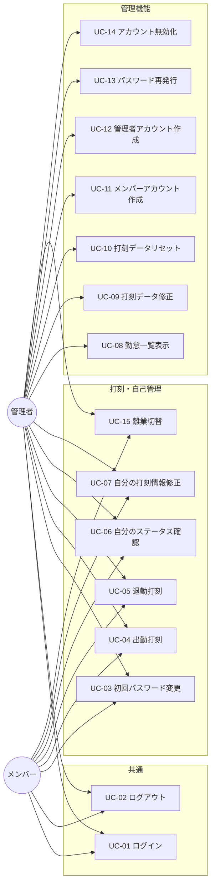

# 勤怠管理Webシステム アクター・ユースケース定義 v0.1

要件定義書 v1.2 に基づくアクターおよびユースケースの整理。

## 1. アクター

| アクター | 概要 | 備考 |
| --- | --- | --- |
| メンバー | 自身の出退勤を打刻する一般利用者 | session.role = `member` |
| 管理者 | 自身の出退勤打刻に加え、全メンバーの勤怠一覧確認、打刻データの修正・リセット、アカウント管理を行う | session.role = `admin`。メンバーの全機能を内包する |
| 初期管理者 | システム導入時に seed 投入される最初の管理者 | 機能上は「管理者」と同一。最初の管理者・メンバー登録の起点となる |

> 「初期管理者」は権限上は通常の「管理者」と同等のため、ユースケース上は **管理者** に集約して扱う。

## 2. ユースケース一覧

| ID | ユースケース | 主アクター |
| --- | --- | --- |
| UC-01 | ログイン | メンバー / 管理者 |
| UC-02 | ログアウト | メンバー / 管理者 |
| UC-03 | 初回パスワード変更 | メンバー / 管理者 |
| UC-04 | 出勤打刻 | メンバー / 管理者 |
| UC-05 | 退勤打刻 | メンバー / 管理者 |
| UC-06 | 自分のステータス確認 | メンバー / 管理者 |
| UC-07 | 自分の打刻情報修正 | メンバー / 管理者 |
| UC-08 | 勤怠一覧表示 | 管理者 |
| UC-09 | 打刻データ修正 | 管理者 |
| UC-10 | 打刻データリセット | 管理者 |
| UC-11 | メンバーアカウント作成 | 管理者 |
| UC-12 | 管理者アカウント作成 | 管理者 |
| UC-13 | パスワード再発行 | 管理者 |
| UC-14 | アカウント無効化 | 管理者 |
| UC-15 | 離業切替（離業 / 業務復帰） | メンバー / 管理者 |

## 3. ユースケース図

## 4. ユースケース記述

### UC-01 ログイン

- **主アクター**: メンバー / 管理者
- **概要**: 社員 ID とパスワードでシステムにログインする
- **事前条件**: 対象アカウントが発行されている
- **基本フロー**:
  1. ログイン画面を開く
  2. 社員 ID とパスワードを入力して送信
  3. 認証成功 → session に role（member / admin）が格納される
  4. role に応じた画面（メンバー画面 / 管理者画面）へ遷移
- **代替・例外フロー**:
  - **3a.** 認証失敗 → エラー表示、再入力
  - **3b.** 初回ログイン（初期パスワードのまま）→ UC-03 へ遷移
  - **3c.** 対象アカウントが無効化済み → ログイン拒否、エラー表示
- **事後条件**: 認証済みセッションが確立される

### UC-02 ログアウト

- **主アクター**: メンバー / 管理者
- **概要**: 現在のセッションを終了する
- **事前条件**: ログイン済み
- **基本フロー**:
  1. ログアウト操作
  2. セッション破棄
  3. ログイン画面へ遷移
- **事後条件**: セッションが無効化される

### UC-03 初回パスワード変更

- **主アクター**: メンバー / 管理者
- **概要**: 管理者が発行した初期パスワードを本人が変更する（初期管理者を含む）
- **事前条件**: 初期パスワードでログイン直後である
- **基本フロー**:
  1. 新しいパスワードを入力
  2. パスワードポリシーを満たしていることを検証
  3. パスワード保存
  4. ロールに応じたトップ画面へ遷移
- **代替・例外フロー**:
  - **2a.** バリデーションエラー（強度不足など）→ 再入力
- **事後条件**: パスワードが更新され、以降は通常ログインで利用可能

### UC-04 出勤打刻

- **主アクター**: メンバー / 管理者
- **概要**: ステータスを **休み（Off）→ 勤務中（Working）** に遷移し、当日の出勤を記録する
- **事前条件**: ログイン済みかつ当日のステータスが **休み（Off）**
- **基本フロー**:
  1. 勤務形態を選択（出社 / 在宅勤務 / 直行）
  2. 出勤打刻ボタンを押下
  3. サーバーが現時刻（JST）で `clockIn` を作成
  4. ステータスが **勤務中（Working）** になる
- **代替・例外フロー**:
  - **2a.** ステータスが Off 以外（既に Working / Away / Done）→ エラー表示し、UC-07 への誘導
- **事後条件**: 当日の出勤打刻データが登録され、ステータス = 勤務中

### UC-05 退勤打刻

- **主アクター**: メンバー / 管理者
- **概要**: ステータスを **勤務中（Working）または 離業中（Away）→ 退勤済（Done）** に遷移し、当日の退勤を記録する
- **事前条件**: 当日のステータスが **勤務中（Working）または 離業中（Away）**
- **基本フロー**:
  1. 勤務形態を選択（通常 / 直帰）
  2. 退勤打刻ボタンを押下
  3. サーバーが現時刻（JST）で `clockOut` を作成
  4. （Away からの場合）アクティブな `AwayPeriod` の終了時刻を `clockOut.at` で確定
  5. ステータスが **退勤済（Done）** になる
- **代替・例外フロー**:
  - **2a.** ステータスが Off（出勤打刻未登録）→ エラー表示
  - **2b.** ステータスが既に Done（退勤済）→ エラー表示
- **事後条件**: 当日の退勤打刻データが登録され、ステータス = 退勤済（終端状態。巻き戻し不可）

### UC-06 自分のステータス確認

- **主アクター**: メンバー / 管理者
- **概要**: 自分の当日の打刻状況とステータスを表示する
- **事前条件**: ログイン済み
- **基本フロー**:
  1. 自身のステータス表示エリアを開く
  2. 当日の出勤時刻 / 退勤時刻 / 勤務形態 / ステータス（休み / 勤務中 / 離業中 / 退勤済）が表示される
  3. 離業中の場合は元の勤務形態を併記して表示する

### UC-07 自分の打刻情報修正

- **主アクター**: メンバー / 管理者
- **概要**: 自分が登録した打刻情報（**打刻時刻 / 勤務形態 / 離業期間**）を手修正する（打ち忘れ・遅延打刻・勤務形態の取り違え・離業時刻のずれ対応）
- **事前条件**: 修正対象の打刻（出勤打刻 / 退勤打刻）が当日に登録済み（離業期間は新規追加も可）
- **基本フロー**:
  1. 自身のステータス表示エリアで対象の時刻・勤務形態を編集、または離業期間の追加・編集・削除を行う
  2. 保存
  3. 更新後の打刻情報が反映される
- **代替・例外フロー**:
  - **2a.** 入力時刻が不正（範囲外、出勤 > 退勤、離業期間が出勤〜退勤の範囲外、離業期間の重複など）→ エラー表示
  - **2b.** 勤務形態が許容範囲外 → エラー表示
  - **2c.** 離業中（status = Away）でアクティブな離業期間を削除しようとした → ステータス整合性違反としてエラー表示
- **事後条件**: 自分の打刻情報（時刻・勤務形態・離業期間）が更新される

### UC-08 勤怠一覧表示

- **主アクター**: 管理者
- **概要**: 全メンバーの勤怠一覧を表示する
- **事前条件**: 管理者としてログイン済み
- **基本フロー**:
  1. 管理者画面を開く（既定では当日の一覧を表示）
  2. 必要に応じて日付ナビで対象日を変更（過去日も閲覧可）
  3. 名前 / 勤務形態 / 出勤時刻 / 退勤時刻 / ステータスが一覧表示される
- **事後条件**: 表示状態のみ。データ更新なし

### UC-09 打刻データ修正

- **主アクター**: 管理者
- **概要**: 任意のメンバー・任意の日付の打刻データ（時刻・勤務形態・離業期間）を編集する
- **事前条件**: 対象メンバー・対象日のレコードが存在する
- **基本フロー**:
  1. 一覧画面から対象メンバー・対象日を選択
  2. 勤務形態 / 出勤時刻 / 退勤時刻を編集、または離業期間の追加・編集・削除を行う
  3. 保存
- **代替・例外フロー**:
  - **2a.** 入力値が不正（時刻範囲、出勤 > 退勤、離業期間の重複など）→ エラー表示
  - **2b.** 編集の結果、ステータスとデータの整合が取れない（例: status = Away なのにアクティブな離業期間がない）→ エラー表示
- **事後条件**: 対象レコードが更新される

### UC-10 打刻データリセット

- **主アクター**: 管理者
- **概要**: 任意のメンバー・任意の日付の打刻データをクリアし、未出勤状態に戻す（メンバーが再打刻できる状態にする）
- **事前条件**: 対象メンバー・対象日のレコードが存在する
- **基本フロー**:
  1. 一覧画面から対象メンバー・対象日のリセット操作を選択
  2. 確認ダイアログで実行を承認
  3. 対象レコードの `clockIn` / `clockOut` を `null` に戻す（レコード自体は保持）
- **代替・例外フロー**:
  - **2a.** ダイアログでキャンセル → 何も変更しない
- **事後条件**:
  - 対象メンバーの当該日のステータスが「未出勤」に戻る
  - 対象メンバーは同日に再度の出勤打刻（UC-04）が可能になる

### UC-11 メンバーアカウント作成

- **主アクター**: 管理者
- **概要**: 新規メンバーのアカウントを発行する
- **事前条件**: 管理者としてログイン済み
- **基本フロー**:
  1. ユーザー管理画面を開く
  2. 社員 ID / 名前 / 初期パスワードを入力
  3. role = member として保存
- **代替・例外フロー**:
  - **2a.** 社員 ID 重複 / バリデーションエラー → エラー表示
- **事後条件**: メンバーが初期パスワードでログイン可能になる（初回ログイン後 UC-03 で変更）

### UC-12 管理者アカウント作成

- **主アクター**: 管理者
- **概要**: 新規管理者のアカウントを発行する
- **事前条件**: 管理者としてログイン済み
- **基本フロー**: UC-11 と同様。ただし role = admin として保存する
- **事後条件**: 新しい管理者がログイン可能になる

### UC-13 パスワード再発行

- **主アクター**: 管理者
- **概要**: パスワードを忘れたメンバー / 管理者に対して、新しいパスワードを発行する
- **事前条件**: 対象アカウントが存在する
- **基本フロー**:
  1. ユーザー一覧から対象アカウントを選択
  2. 新しいパスワードを発行
  3. 対象ユーザーへ口頭などで連絡（システム外）
- **事後条件**: 対象ユーザーは新パスワードでログイン可能になる（パスワード再変更の強制はなし）

### UC-14 アカウント無効化

- **主アクター**: 管理者
- **概要**: 退職等によりアカウント利用を停止する。過去の勤怠データは保持したままログイン不可とする
- **事前条件**: 対象アカウントが存在し、有効である
- **基本フロー**:
  1. ユーザー一覧から対象アカウントを選択
  2. 無効化操作を選び、確認ダイアログで承認
  3. 対象アカウントを無効化（論理的にログイン不可とする）
- **代替・例外フロー**:
  - **2a.** ダイアログでキャンセル → 何も変更しない
- **事後条件**:
  - 対象アカウントはログイン不可となる
  - 過去の勤怠データは削除されず保持される

### UC-15 離業切替（離業 / 業務復帰）

- **主アクター**: メンバー / 管理者
- **概要**: 自身のステータスを **勤務中（Working） ⇄ 離業中（Away）** で切り替える。離業の開始/終了時刻も記録する
- **事前条件**: 当日のステータスが **勤務中（Working）** または **離業中（Away）**
- **基本フロー（離業：Working → Away）**:
  1. 「離業」操作を選択
  2. サーバーが現時刻（JST）で新しい `AwayPeriod` を作成（`startedAt = 現時刻`、`endedAt = null`）
  3. ステータスが **離業中（Away）** になる
- **基本フロー（業務復帰：Away → Working）**:
  1. 「業務復帰」操作を選択
  2. アクティブな（`endedAt = null` の）`AwayPeriod` の `endedAt` を現時刻で確定
  3. ステータスが **勤務中（Working）** に戻る
- **代替・例外フロー**:
  - **2a.** ステータスが Off / Done のときの操作 → エラー表示
- **事後条件**:
  - 状態が切り替わる
  - 離業の `startedAt` / `endedAt` が `AwayPeriod` として記録される
  - 離業中であっても元の勤務形態（出勤打刻時の選択値）は保持される

## 5. 残課題（要確認）

| # | 内容 | 影響範囲 |
| --- | --- | --- |
| Q1 | 監査ログ（誰がいつ修正・リセットしたか）の保持要否 | UC-09 / UC-10 / UC-13 / UC-14 |
| Q2 | 勤怠一覧（UC-08）に管理者自身の打刻データを含めて表示するか | UC-08 表示対象 |
| Q3 | 無効化済みアカウントの再有効化フローの要否 | UC-14 関連 |
