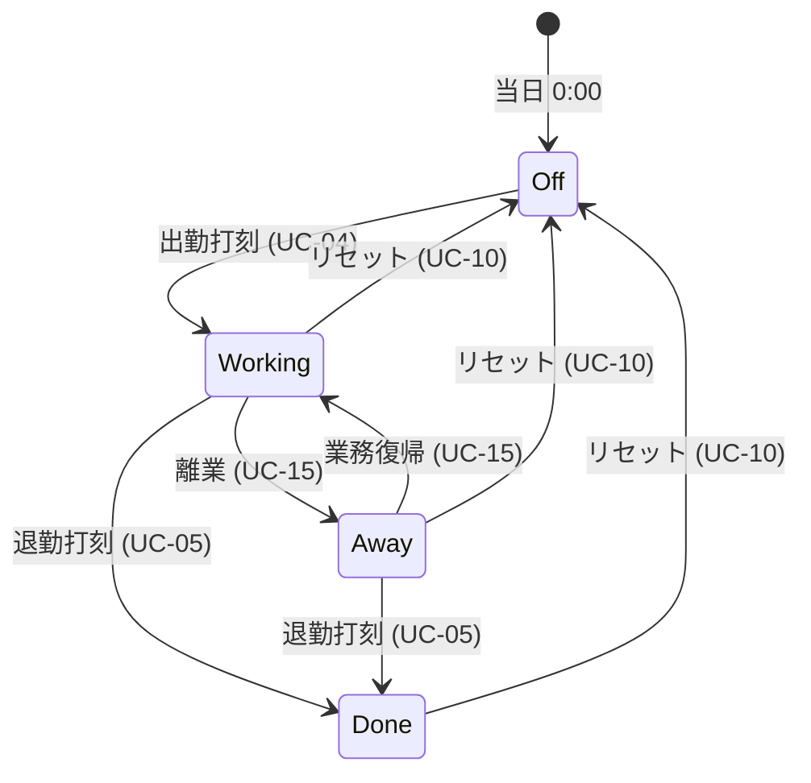
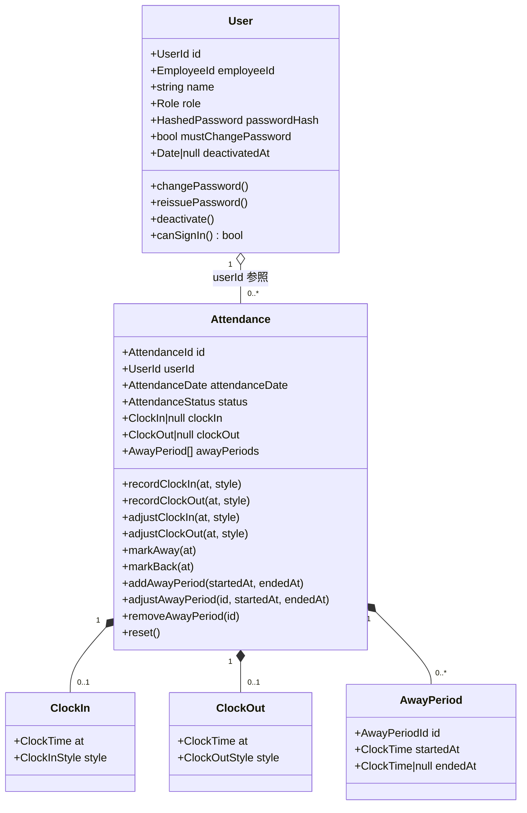

# 勤怠管理Webシステム ドメイン設計 v0.1

要件定義書 v1.2 / ユースケース定義 v0.1 / ユビキタス言語 v0.1 を踏まえたドメインモデルの定義。

> 本書では「型」「フィールド」をドメイン上の概念として記述する。実装上の詳細（DB スキーマ・ライブラリ固有の制約）は設計／実装フェーズで確定する。

## 1. エンティティ

エンティティは **同一性 (identity)** によって区別され、ライフサイクルを持つ。

### 1.1 User

ユーザーアカウントを表すエンティティ。

| フィールド | 型 | 説明 |
| --- | --- | --- |
| id | `UserId` | 内部識別子 |
| employeeId | `EmployeeId` | ログイン用の業務識別子 |
| name | `string` | 表示名 |
| role | `Role` | `member` / `admin` |
| passwordHash | `HashedPassword` | パスワードのハッシュ |
| mustChangePassword | `boolean` | 次回ログイン時にパスワード変更を強制するか |
| deactivatedAt | `Date \| null` | 無効化日時。`null` なら有効 |
| createdAt | `Date` | 作成日時 |

**ライフサイクル**

- 管理者により作成（UC-11 / UC-12）→ `mustChangePassword = true` で生成
- 初回ログイン時に本人がパスワード変更（UC-03）→ `mustChangePassword = false`
- 管理者によるパスワード再発行（UC-13）→ `passwordHash` を更新、`mustChangePassword` は変更しない
- 管理者による無効化（UC-14）→ `deactivatedAt` をセット

### 1.2 Attendance

1 ユーザーの 1 日分の出退勤記録を表すエンティティ。

| フィールド | 型 | 説明 |
| --- | --- | --- |
| id | `AttendanceId` | 内部識別子 |
| userId | `UserId` | 対象ユーザー |
| attendanceDate | `AttendanceDate` | 勤怠日付（JST） |
| status | `AttendanceStatus` | 当日のステータス（明示フィールド・状態機械で遷移） |
| clockIn | `ClockIn \| null` | 出勤打刻情報。未打刻なら `null` |
| clockOut | `ClockOut \| null` | 退勤打刻情報。未打刻なら `null` |
| awayPeriods | `AwayPeriod[]` | 離業期間の一覧（0 件以上） |
| createdAt | `Date` | 作成日時 |
| updatedAt | `Date` | 更新日時 |

**ライフサイクル**

- レコード作成時の初期 `status` は **Off**（休み）
- 出勤打刻（UC-04）で `clockIn` をセットし `status = Working` に遷移
- 離業（UC-15）で新しい `AwayPeriod` を生成（`startedAt = 現時刻`、`endedAt = null`）し `status = Away` に遷移
- 業務復帰（UC-15）でアクティブな `AwayPeriod` の `endedAt` を確定し `status = Working` に戻す
- 退勤打刻（UC-05）で `clockOut` をセット（Away からの場合はアクティブな `AwayPeriod.endedAt` も `clockOut.at` で確定）し `status = Done` に遷移
- 打刻情報（時刻・勤務形態）の手修正（UC-07 / UC-09）で `clockIn` / `clockOut` の各フィールドを更新
- リセット（UC-10）で `clockIn` / `clockOut` を `null` に、`awayPeriods` を空に、`status = Off` に戻す（**レコード自体は保持**）

### 1.3 AwayPeriod（離業期間：Attendance 集約内の子エンティティ）

| フィールド | 型 | 説明 |
| --- | --- | --- |
| id | `AwayPeriodId` | 集約内識別子 |
| startedAt | `ClockTime` | 離業開始時刻 |
| endedAt | `ClockTime \| null` | 離業終了時刻。離業中（アクティブ）なら `null` |

**ライフサイクル**

- 離業（UC-15）で生成、`startedAt = 現時刻`、`endedAt = null`
- 業務復帰（UC-15）または退勤打刻（UC-05、Away からの遷移）で `endedAt` を確定
- リセット（UC-10）で破棄

## 2. 値オブジェクト

値オブジェクトは **値そのもの** で同一性を持たず、不変。

### 2.1 識別子系

| 値オブジェクト | 構造 | 不変条件 |
| --- | --- | --- |
| `UserId` | string（UUID 等） | 形式が UUID 規約に準拠 |
| `AttendanceId` | string（UUID 等） | 形式が UUID 規約に準拠 |
| `EmployeeId` | string | 空文字不可・形式や桁数は要確定 |

### 2.2 認証関連

| 値オブジェクト | 構造 | 不変条件 |
| --- | --- | --- |
| `Role` | enum: `'member'` \| `'admin'` | 列挙値以外は不可 |
| `HashedPassword` | string | 既定のハッシュ形式（argon2 / bcrypt 等）に準拠。平文は保持しない |

### 2.3 時間軸

| 値オブジェクト | 構造 | 不変条件 |
| --- | --- | --- |
| `AttendanceDate` | JST 日付（YYYY-MM-DD） | タイムゾーン JST。Phase 1 では深夜跨ぎ未対応 |
| `ClockTime` | JST timestamp | `attendanceDate` の範囲内（0:00〜23:59） |

### 2.4 勤務形態

| 値オブジェクト | 構造 | 不変条件 |
| --- | --- | --- |
| `ClockInStyle` | enum: `'office'` \| `'remote'` \| `'direct_visit'` | 列挙値以外は不可 |
| `ClockOutStyle` | enum: `'normal'` \| `'direct_return'` | 列挙値以外は不可 |

### 2.5 打刻情報

| 値オブジェクト | 構造 | 不変条件 |
| --- | --- | --- |
| `ClockIn` | `{ at: ClockTime, style: ClockInStyle }` | 両フィールド必須 |
| `ClockOut` | `{ at: ClockTime, style: ClockOutStyle }` | 両フィールド必須 |

### 2.6 ステータス（明示フィールド・状態機械）

| 値オブジェクト | 構造 | 不変条件 |
| --- | --- | --- |
| `AttendanceStatus` | enum: `'off'` \| `'working'` \| `'away'` \| `'done'` | `Attendance.status` として **永続化** される。状態遷移ルール（L4）に従って変化 |

状態遷移図:



## 3. 集約

集約は **不変条件を保証する境界**。集約内は強整合、集約間は ID 参照のみ。

### 3.1 User 集約

```
[ User (root) ]
  ├─ EmployeeId
  ├─ Role
  └─ HashedPassword
```

- **集約ルート**: `User`
- **含む VO**: `EmployeeId` / `Role` / `HashedPassword`
- **不変条件**:
  - `employeeId` は全 User 間で一意（→ ドメインサービス＋DB 一意制約で担保）
  - `role` は列挙値のいずれか
  - `deactivatedAt` がセットされている User はログイン不可（後述 L10）

### 3.2 Attendance 集約

```
[ Attendance (root) ]
  ├─ AttendanceStatus
  ├─ AttendanceDate
  ├─ ClockIn  ── { ClockTime, ClockInStyle }
  ├─ ClockOut ── { ClockTime, ClockOutStyle }
  └─ AwayPeriod[] ── { ClockTime startedAt, ClockTime|null endedAt }
```

- **集約ルート**: `Attendance`
- **含む VO**: `AttendanceStatus` / `AttendanceDate` / `ClockIn` / `ClockOut`
- **集約内子エンティティ**: `AwayPeriod`（0 件以上）
- **User 集約とは `userId` による参照のみ**（直接の参照を持たない）
- **不変条件**:
  - 同一 (`userId`, `attendanceDate`) のレコードは 1 件まで（→ L1）
  - `status` は状態遷移図に従って変化する（→ L4）
  - `status === 'off'` のとき: `clockIn === null` かつ `clockOut === null` かつ `awayPeriods` が空
  - `status === 'working'`: `clockIn !== null` かつ `clockOut === null` かつ アクティブな `AwayPeriod` がない
  - `status === 'away'`: `clockIn !== null` かつ `clockOut === null` かつ アクティブな `AwayPeriod` がちょうど 1 件
  - `status === 'done'`: `clockIn !== null` かつ `clockOut !== null` かつ アクティブな `AwayPeriod` がない
  - `clockOut` がセットされている場合、`clockIn` も必ずセットされている（→ L3）
  - `clockIn.at` ≤ `clockOut.at`（→ L2）
  - 各 `AwayPeriod` について `startedAt` ≤ `endedAt`（`endedAt` が確定している場合）
  - 各 `AwayPeriod` の時刻は `clockIn.at` 以降、`clockOut.at` 以前（`clockOut` 未確定時は当日範囲内）
  - アクティブな（`endedAt === null`）`AwayPeriod` は同時に最大 1 件

## 4. ドメインロジック

集約・エンティティ・VO のいずれが責務を持つかを明確にする。

| # | ロジック | 配置 | 説明 |
| --- | --- | --- | --- |
| L1 | 二重出勤打刻の禁止 | `Attendance` エンティティ + DB 一意制約 | 1 (`userId`, `attendanceDate`) ごとにレコードは 1 件（DB 一意制約）。出勤打刻は `status === 'off'` のときのみ許可（リセット後の再打刻は許容） |
| L2 | 出勤時刻 ≤ 退勤時刻 | `Attendance` エンティティ | `clockOut` セット時 / 時刻修正時に検証 |
| L3 | 退勤打刻の前提条件 | `Attendance` エンティティ | `status` が `'working'` または `'away'` のときのみ退勤打刻可（Off / Done 時は不可） |
| L4 | `AttendanceStatus` の状態遷移 | `Attendance` エンティティ | 2.6 の状態遷移図に従う。`done` は終端（リセット以外で他状態へ戻れない） |
| L5 | 打刻情報の手修正（時刻 / 勤務形態） | `Attendance` エンティティ | `clockIn` / `clockOut` の `at`・`style` を上書き。L2 を必ず検証。`status` は変更しない |
| L6 | リセット | `Attendance` エンティティ | `clockIn` / `clockOut` を `null`、`awayPeriods` を空、`status` を `'off'` に戻す（**レコード自体は保持**） |
| L7 | 初回パスワード変更要求 | `User` エンティティ | `mustChangePassword === true` のときログイン直後に変更フローへ誘導（UC-03） |
| L8 | パスワードの変更 | `User` エンティティ | 本人によるパスワード変更。新ハッシュをセットし `mustChangePassword = false` |
| L9 | パスワード再発行 | `User` エンティティ | 管理者から新ハッシュをセット。`mustChangePassword` は変更しない |
| L10 | アカウント無効化 / 認証可否判定 | `User` エンティティ | `deactivate()` で `deactivatedAt` をセット。`canSignIn()` は `deactivatedAt === null` を返す |
| L11 | 勤務形態の整合性 | `ClockIn` / `ClockOut` VO | enum 範囲外を拒否（VO の生成時に検証） |
| L12 | 当日重複出勤打刻時の挙動 | アプリケーション層 | L1 で拒否されたケースは UC-04 のエラー表示にマップ |
| L13 | 離業切替（`markAway()` / `markBack()`） | `Attendance` エンティティ | `markAway()`: `status === 'working'` のとき新規 `AwayPeriod` を生成し `status = 'away'`。`markBack()`: `status === 'away'` のときアクティブな `AwayPeriod.endedAt` を確定し `status = 'working'` |
| L14 | `AwayPeriod` の整合性 | `Attendance` エンティティ + `AwayPeriod` 子エンティティ | `startedAt ≤ endedAt`、`clockIn.at ≤ startedAt`、`endedAt ≤ clockOut.at`（`clockOut` 確定時）、アクティブな `AwayPeriod` は同時に最大 1 件 |
| L15 | Away からの退勤打刻 | `Attendance` エンティティ | `status === 'away'` で退勤打刻時、アクティブな `AwayPeriod.endedAt` を `clockOut.at` で確定してから `status = 'done'` に遷移 |
| L16 | 離業期間の手修正（追加・編集・削除） | `Attendance` エンティティ | `addAwayPeriod(startedAt, endedAt)` / `adjustAwayPeriod(id, startedAt?, endedAt?)` / `removeAwayPeriod(id)`。手動追加は **クローズ済みの期間のみ**（`startedAt` / `endedAt` 両方必須）。アクティブな期間の編集・削除は `markBack()` 経由で行う。適用後に L14 と 3.2 のステータス整合性が崩れた場合は拒否 |

## 5. ドメインサービス

集約内のメソッドだけでは表現しづらい操作を担う。本ドメインは集約 2 つで完結するため、ドメインサービスは最小限で済む。

### 5.1 `UserCreationService`

- **責務**: 新規 User の作成（UC-11 / UC-12）
- **主処理**:
  1. `EmployeeId` の重複を `UserRepository` で検証
  2. 初期パスワードを `PasswordHasher` でハッシュ化
  3. `mustChangePassword = true` で `User` を生成して保存
- **依存**: `UserRepository`, `PasswordHasher`

### 5.2 `PasswordReissueService`

- **責務**: 管理者によるパスワード再発行（UC-13）
- **主処理**:
  1. 新しいパスワードを `PasswordHasher` でハッシュ化
  2. 対象 `User` の `passwordHash` を更新
  3. `mustChangePassword` は変更しない（要件 Q3 反映）
- **依存**: `UserRepository`, `PasswordHasher`

### 5.3 `AuthenticationService`（薄いラッパー想定）

- **責務**: ログイン時の認証ロジック（UC-01）
- **主処理**:
  1. `EmployeeId` で `User` を取得
  2. パスワード検証
  3. `User.canSignIn()`（L10）で無効化チェック
  4. `mustChangePassword` を含むセッション情報を返却
- **依存**: `UserRepository`, `PasswordHasher`
- **備考**: 認証本体は Better Auth に委譲。本サービスはドメイン側の前後条件を表現するレイヤとしての役割に留める。

> `PasswordHasher` は **インフラの抽象** としてドメイン層に interface のみ置く想定（実装はインフラ層）。

## 6. 集約・参照関係（概念図）



## 7. 残課題

- **`EmployeeId` の形式** — 桁数 / 文字種ルールを確定する必要がある
- **監査ログ** — 修正・リセット・無効化の操作履歴を残す場合、`AuditLog` 集約を別途追加する（要件側 Q1 と連動）
- **`AttendanceListAggregator`** — 管理者画面（UC-08）の一覧取得は読み取り専用クエリ。ドメインサービスにはせず、アプリケーション層のクエリサービスとして扱う想定
