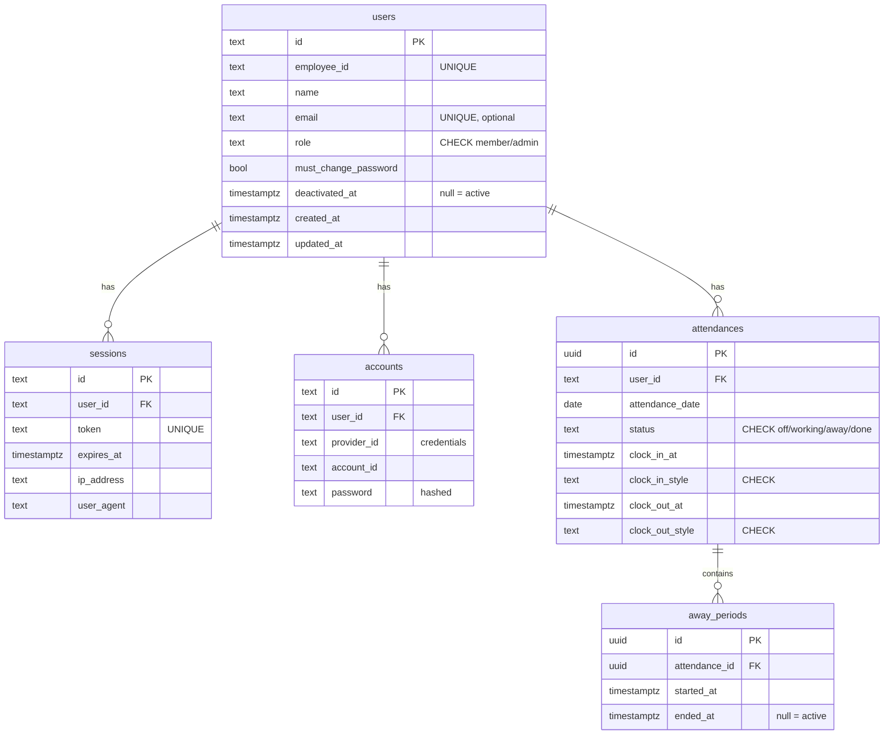

# 勤怠管理Webシステム DB 設計 v0.1

要件定義書 v1.2 / ユースケース定義 v0.1 / ユビキタス言語 v0.1 / ドメイン設計 v0.1 を踏まえた PostgreSQL スキーマ設計。

> **DB**: PostgreSQL（本番: Neon / 開発: Docker Compose）
> **ORM**: Drizzle
> **認証**: Better Auth（一部テーブルは Better Auth が管理）

## 1. 全体方針

### 1-1. 命名規則

| 用途 | 規則 |
| --- | --- |
| テーブル名 | snake_case 複数形（例: `users`, `attendances`） |
| カラム名 | snake_case 単数形（例: `clock_in_at`） |
| 主キー | `id`（UUID または Better Auth の text ID） |
| 外部キー | `<参照先テーブル単数形>_id`（例: `user_id`） |
| 真偽値 | `is_*` / `has_*` / `must_*` などの述語形 |
| 時刻系 | `*_at`（例: `created_at`、`clock_in_at`） |
| 日付系 | `*_date`（例: `attendance_date`） |

### 1-2. 型方針

| ドメイン概念 | DB 型 | 備考 |
| --- | --- | --- |
| `UserId` (Better Auth) | `text` | Better Auth が生成（CUID / UUID 等） |
| `AttendanceId` / `AwayPeriodId` | `uuid` | `gen_random_uuid()` を既定値に |
| `EmployeeId` | `text` | UNIQUE 制約 |
| timestamp 系 | `timestamptz` | **UTC 保存・表示は JST 変換**（アプリ層で吸収） |
| date 系 | `date` | `attendance_date` は JST 基準の日付 |
| enum 系 | `text` + `CHECK` 制約 | Postgres ENUM 型ではなく文字列＋CHECK で運用（追加変更がしやすい） |

### 1-3. テーブル分類

| 分類 | テーブル | 管理主体 |
| --- | --- | --- |
| 認証 | `users` / `sessions` / `accounts` / `verifications` | Better Auth |
| ドメイン | `attendances` / `away_periods` | アプリ |

## 2. Better Auth 管理テーブル

Better Auth の標準スキーマに **拡張フィールド** を加える。CLI / 設定で生成するが、本書では **論理スキーマ** として記述する。

### 2-1. `users`

ユーザーアカウント（Better Auth コアエンティティ + ドメイン拡張）。

```sql
CREATE TABLE users (
  -- Better Auth 標準フィールド
  id                    text PRIMARY KEY,
  name                  text NOT NULL,
  email                 text UNIQUE,                       -- 本サービスでは未使用（合成値 or null）
  email_verified        boolean NOT NULL DEFAULT false,
  image                 text,
  created_at            timestamptz NOT NULL DEFAULT now(),
  updated_at            timestamptz NOT NULL DEFAULT now(),

  -- 本サービスの拡張フィールド
  employee_id           text NOT NULL UNIQUE,
  role                  text NOT NULL DEFAULT 'member'
                          CHECK (role IN ('member', 'admin')),
  must_change_password  boolean NOT NULL DEFAULT true,
  deactivated_at        timestamptz                         -- null なら有効
);

CREATE INDEX idx_users_employee_id  ON users (employee_id);
CREATE INDEX idx_users_active       ON users (deactivated_at)
  WHERE deactivated_at IS NULL;
```

**メモ**

- `email` は Better Auth の標準必須カラム。本サービスは社員 ID ログインなので、運用上は使わない。**Better Auth 設定で email 必須を外す**、または合成値（`{employee_id}@kintaiapp.local`）で埋める想定（実装フェーズで確定）。
- `password` は本テーブルではなく `accounts` に格納される（Better Auth の credentials provider 仕様）。
- `deactivated_at` を NULL とする条件をインデックス化（管理者一覧で「有効ユーザーのみ」を高速取得）。

### 2-2. `sessions`

```sql
CREATE TABLE sessions (
  id            text PRIMARY KEY,
  user_id       text NOT NULL REFERENCES users(id) ON DELETE CASCADE,
  token         text NOT NULL UNIQUE,
  expires_at    timestamptz NOT NULL,
  ip_address    text,
  user_agent    text,
  created_at    timestamptz NOT NULL DEFAULT now(),
  updated_at    timestamptz NOT NULL DEFAULT now()
);

CREATE INDEX idx_sessions_user_id ON sessions (user_id);
CREATE INDEX idx_sessions_expires_at ON sessions (expires_at);
```

> Better Auth の `customSession` で `role` / `must_change_password` を session に乗せる想定。テーブル構造は標準のまま。

### 2-3. `accounts`

Better Auth の認証プロバイダ管理用テーブル。本サービスでは **credentials provider のみ** 使用。

```sql
CREATE TABLE accounts (
  id                          text PRIMARY KEY,
  user_id                     text NOT NULL REFERENCES users(id) ON DELETE CASCADE,
  provider_id                 text NOT NULL,           -- 'credentials' を想定
  account_id                  text NOT NULL,           -- provider_id ごとの ID
  password                    text,                    -- ハッシュ済パスワード（credentials のみ）
  access_token                text,
  refresh_token               text,
  id_token                    text,
  access_token_expires_at     timestamptz,
  refresh_token_expires_at    timestamptz,
  scope                       text,
  created_at                  timestamptz NOT NULL DEFAULT now(),
  updated_at                  timestamptz NOT NULL DEFAULT now(),

  UNIQUE (provider_id, account_id)
);

CREATE INDEX idx_accounts_user_id ON accounts (user_id);
```

### 2-4. `verifications`

```sql
CREATE TABLE verifications (
  id            text PRIMARY KEY,
  identifier    text NOT NULL,
  value         text NOT NULL,
  expires_at    timestamptz NOT NULL,
  created_at    timestamptz NOT NULL DEFAULT now(),
  updated_at    timestamptz NOT NULL DEFAULT now()
);

CREATE INDEX idx_verifications_identifier ON verifications (identifier);
```

> Phase 1 では使用しない（メール認証・パスワードリセット導線なし）。Better Auth が標準で要求するため作成しておく。

## 3. ドメインテーブル

### 3-1. `attendances`

1 ユーザー × 1 日 = 1 レコード。Attendance 集約のルート。

```sql
CREATE TABLE attendances (
  id                  uuid PRIMARY KEY DEFAULT gen_random_uuid(),
  user_id             text NOT NULL REFERENCES users(id) ON DELETE RESTRICT,
  attendance_date     date NOT NULL,                  -- JST 日付

  status              text NOT NULL DEFAULT 'off'
                        CHECK (status IN ('off', 'working', 'away', 'done')),

  -- 出勤打刻
  clock_in_at         timestamptz,                    -- null = 未打刻
  clock_in_style      text
                        CHECK (clock_in_style IN ('office', 'remote', 'direct_visit')),

  -- 退勤打刻
  clock_out_at        timestamptz,                    -- null = 未打刻
  clock_out_style     text
                        CHECK (clock_out_style IN ('normal', 'direct_return')),

  created_at          timestamptz NOT NULL DEFAULT now(),
  updated_at          timestamptz NOT NULL DEFAULT now(),

  -- L1: 1 ユーザー × 1 日に 1 レコード
  UNIQUE (user_id, attendance_date),

  -- 出勤打刻は時刻と勤務形態がペア
  CHECK (
    (clock_in_at IS NULL AND clock_in_style IS NULL) OR
    (clock_in_at IS NOT NULL AND clock_in_style IS NOT NULL)
  ),

  -- 退勤打刻は時刻と勤務形態がペア
  CHECK (
    (clock_out_at IS NULL AND clock_out_style IS NULL) OR
    (clock_out_at IS NOT NULL AND clock_out_style IS NOT NULL)
  ),

  -- L3: clockOut が立つなら clockIn も立っている
  CHECK (clock_out_at IS NULL OR clock_in_at IS NOT NULL),

  -- L2: 出勤時刻 ≤ 退勤時刻
  CHECK (clock_out_at IS NULL OR clock_in_at <= clock_out_at),

  -- L4: status と打刻フィールドの整合（aware away との細かい区別はアプリ層）
  CHECK (
    (status = 'off'     AND clock_in_at IS NULL  AND clock_out_at IS NULL) OR
    (status = 'working' AND clock_in_at IS NOT NULL AND clock_out_at IS NULL) OR
    (status = 'away'    AND clock_in_at IS NOT NULL AND clock_out_at IS NULL) OR
    (status = 'done'    AND clock_in_at IS NOT NULL AND clock_out_at IS NOT NULL)
  )
);

CREATE INDEX idx_attendances_date ON attendances (attendance_date);
CREATE INDEX idx_attendances_user_date ON attendances (user_id, attendance_date);
CREATE INDEX idx_attendances_status ON attendances (status);
```

**アプリ層で担保する不変条件**

- `status === 'working'`: アクティブな `away_period` が **0 件**
- `status === 'away'`: アクティブな `away_period` が **ちょうど 1 件**
- 上記は `away_periods` を JOIN しないと判定できないため、Attendance 集約のメソッドで保証する

### 3-2. `away_periods`

離業期間。Attendance 集約内の子エンティティ。

```sql
CREATE TABLE away_periods (
  id              uuid PRIMARY KEY DEFAULT gen_random_uuid(),
  attendance_id   uuid NOT NULL REFERENCES attendances(id) ON DELETE CASCADE,
  started_at      timestamptz NOT NULL,
  ended_at        timestamptz,                              -- null = アクティブ（離業中）
  created_at      timestamptz NOT NULL DEFAULT now(),
  updated_at      timestamptz NOT NULL DEFAULT now(),

  -- L14: started_at ≤ ended_at（ended_at が null 以外のとき）
  CHECK (ended_at IS NULL OR started_at <= ended_at)
);

CREATE INDEX idx_away_periods_attendance_id ON away_periods (attendance_id);

-- L14 / L13: アクティブな離業期間は同時に 1 件まで（部分 UNIQUE インデックス）
CREATE UNIQUE INDEX idx_away_periods_one_active_per_attendance
  ON away_periods (attendance_id)
  WHERE ended_at IS NULL;
```

**アプリ層で担保する不変条件**

- 離業期間が `clock_in_at`〜`clock_out_at` の範囲内
- 同一 `attendance_id` 内の離業期間同士は時間的に重ならない

> 範囲チェックは `attendances` への参照が必要なため CHECK 制約だけでは表現しきれない。Attendance 集約メソッドで担保。

## 4. ER 図



## 5. 制約・整合性まとめ

| 不変条件（Domain） | DB 担保 | アプリ層担保 |
| --- | --- | --- |
| L1: 1 (`user_id`, `attendance_date`) で 1 レコード | UNIQUE (user_id, attendance_date) | — |
| L2: clockIn ≤ clockOut | CHECK | — |
| L3: clockOut 単独不可 | CHECK | — |
| L4: status と打刻フィールドの整合（off/working/away/done） | CHECK（部分） | aware と away の `away_periods` 整合は L14 と合わせアプリ層 |
| 出勤打刻 / 退勤打刻 の at と style はペア | CHECK | — |
| L14: 各 AwayPeriod の `startedAt ≤ endedAt` | CHECK | — |
| L14: AwayPeriod が `clockIn.at`〜`clockOut.at` 範囲内 | — | アプリ層 |
| L14: AwayPeriod 同士の重複禁止 | — | アプリ層 |
| L14: アクティブな AwayPeriod は同時に 1 件 | 部分 UNIQUE インデックス | — |
| `employee_id` の一意性 | UNIQUE | — |
| 無効化済 user の認証可否 | — | アプリ層（L10） |

## 6. マイグレーション方針

| 項目 | 方針 |
| --- | --- |
| ツール | **Drizzle Kit**（`drizzle-kit generate` / `drizzle-kit migrate`） |
| マイグレーションファイル | `drizzle/` 配下に `0000_xxx.sql` の形で蓄積 |
| Better Auth スキーマ | Better Auth CLI で生成 → Drizzle スキーマに統合 or 手書きで一致させる |
| 開発環境 | Docker Compose の Postgres にローカル適用 |
| 本番（Neon） | CI/CD or 手動で `drizzle-kit migrate` を流す |
| ロールバック | 小規模なため down マイグレーションは原則作らず、フォワード修正で対応 |

## 7. シード方針

### 7-1. 初期管理者

要件 7（ユーザー管理運用）より、システム導入時に **初期管理者を 1 アカウントだけ seed で投入** する。

```ts
// 例：seed スクリプトの擬似コード
await db.insert(users).values({
  id: generateId(),
  name: process.env.INITIAL_ADMIN_NAME,
  employee_id: process.env.INITIAL_ADMIN_EMPLOYEE_ID, // 例: 'admin'
  role: 'admin',
  must_change_password: true,            // 初回ログインで強制変更
  deactivated_at: null,
});

await db.insert(accounts).values({
  user_id: <上記 id>,
  provider_id: 'credentials',
  account_id: <上記 employee_id>,
  password: await hashPassword(process.env.INITIAL_ADMIN_PASSWORD),
});
```

| 項目 | 値の出所 |
| --- | --- |
| 社員 ID | 環境変数 `INITIAL_ADMIN_EMPLOYEE_ID`（既定: `admin`） |
| 名前 | 環境変数 `INITIAL_ADMIN_NAME` |
| 初期パスワード | 環境変数 `INITIAL_ADMIN_PASSWORD`（強度ポリシー要確定） |
| `must_change_password` | `true`（初回ログインで UC-03 が走る） |

### 7-2. 開発用ダミーデータ

開発環境用に、メンバー数名 + 数日分の Attendance / AwayPeriod を投入するスクリプトを別途用意する想定（任意）。

## 8. パフォーマンス想定

Phase 1 の規模（数十人〜数百人想定）では Neon の最小プランで十分。主要クエリ:

| クエリ | 想定インデックス | 想定レイテンシ |
| --- | --- | --- |
| 当日の全員 attendances 取得（UC-08） | `idx_attendances_date` | ms 単位 |
| 自分の今日の attendance（UC-06） | `idx_attendances_user_date` | ms 単位 |
| ユーザー一覧（管理画面） | `idx_users_active` | ms 単位 |
| 認証時の user 取得 | `idx_users_employee_id` | ms 単位 |

## 9. 残課題

- **Better Auth の email 必須要件への対処** — 本当に email を NULL にできるか、合成値で運用するかは Better Auth の挙動を実装フェーズで確認
- **`employee_id` の形式（桁数・文字種）** — 確定後に CHECK 制約 / Drizzle 側のバリデーション追加
- **パスワードポリシー** — DB 側ではなく Better Auth / アプリ層で担保
- **監査ログ** — 必要が出たら `audit_logs` テーブルを追加（要件 Q1 と連動）
- **論理削除 vs 物理削除（user）** — 現状は `deactivated_at` で論理無効化のみ。完全削除を要するケースが出れば検討
- **`attendance_date` のタイムゾーン解釈** — JST 基準を全層で徹底（Drizzle の date 型 + アプリ層での dayjs/date-fns-tz 使用想定）
- **「status = away かつ active な away_period がない / status = working かつ active な away_period がある」**の検出 — DB 側では原則担保不可なので、Attendance 集約メソッドでの厳格な制御 + 統合テストで担保
